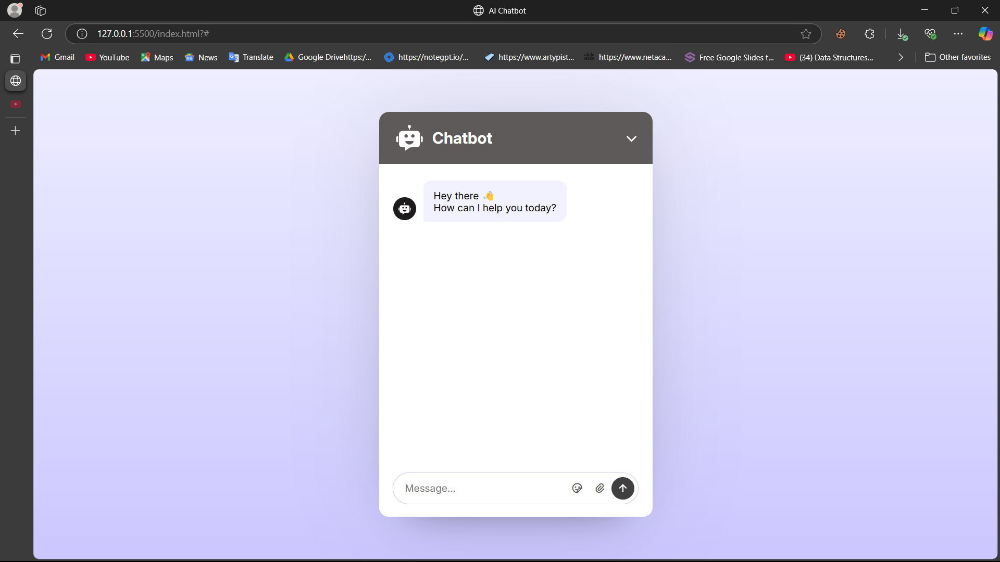

## To run this program , you should go to the live server and then click on the button to see the result.
## 

## These Frequently Asked Questions Will works and this will be the final answer. I hope it is correct.
 hello: "Hello! How can I help you today? I'm here to answer your questions.",

  admission:
    "Admissions for the academic year begin in May and end in July. You can apply online via our official college website. Required documents include 10th and 12th mark sheets, transfer certificate, migration certificate (if applicable), and a recent passport-size photograph.",

  fee: "Our annual tuition fee is ₹1,00,000 for most undergraduate programs. This includes library and lab charges. Payment can be done through UPI, debit/credit cards, bank transfer, or at the college office. Scholarships and installment options are available for eligible students.",

  courses:
    "We offer a range of UG and PG courses including B.Tech, BCA, BBA, MCA, MBA, and M.Tech. Each course is designed with practical training, industry exposure, and internship opportunities. Our faculty is experienced and well-qualified.",

  timing:
    "Our regular college hours are from 9:00 AM to 4:00 PM, Monday to Saturday. Practical and lab sessions may extend beyond these hours based on the course schedule. We also have online classes for students who cannot attend in-person sessions.",

  location:
    "The college is situated near Khurrampur, Farrukh Nagar, Haily Mandi Road, Gurgaon, Delhi (NCR). It is well-connected by public transport, and local buses and autos are easily available from the main railway and bus station. Parking is available on campus. You can also visit the college website for directions and maps.",

  contact:
    "You can reach us at 8102309830 during working hours or email us at i0lG8@example.com for queries related to admission, course details, and administration.",

  hostel:
    "We offer hostel facilities for both boys and girls with 24/7 security, Wi-Fi, mess, and laundry services. The hostels are located within walking distance from the main campus.",

  placement:
    "Our college has a dedicated placement cell with tie-ups with top companies like Autodesk, JellyFish, Chetu, EduTep, Accenture, Dellotte, TCS, Infosys, Wipro, and HCL. Students receive training in soft skills, mock interviews, and resume building. Placement drives are held every semester. Placements are based on CGPA and interview performance. Recently Two students got placed in AutoDesk with a package of ₹45 LPA.",

  scholarship:
    "We offer merit-based scholarships, government scholarships, and financial aid for economically weaker students. You need to submit income proof and academic records to apply.",

  library:
    "Our library has over 20,000 books, journals, e-books, and digital resources. Students can borrow up to 4 books at a time and access digital materials online using their student credentials.",

  transport:
    "Yes, we have a fleet of college buses covering major routes in and around the city. Bus passes can be availed from the transport office within the campus.",

  canteen:
    "We have a hygienic and affordable canteen that serves breakfast, lunch, snacks, and beverages. Both vegetarian and non-vegetarian food options are available.",

  sports:
    "We encourage sports and have facilities for cricket, football, volleyball, table tennis, and indoor games. Annual sports meet and inter-college tournaments are regularly organized.",

  wifi: "Yes, the campus is Wi-Fi enabled. Students get access to high-speed internet using their student ID login credentials. You can also access the college website from your mobile device.",

  attendance:
    "A minimum of 75% attendance is required in each subject to be eligible for the semester examinations. Students are advised to maintain regular attendance to avoid academic issues. Leave applications must be submitted in advance. Late submission of leave applications may result in disciplinary action.",

  exam: "Semester exams are conducted twice a year. Mid-term assessments and project work are also part of the evaluation system. Students can check their exam schedule and results on the college website. Exams are conducted in the morning and afternoon sessions. The exam schedule is published on the college website.",

  faculty:
    "We have experienced and highly qualified faculty members with academic and industry backgrounds. Most hold PhDs or have more than 10 years of teaching experience. They are available for office hours and can be reached via email or phone.",

  internship:
    "Internships are part of the curriculum for most courses. The placement cell assists students in finding suitable internships in reputed organizations. Students receive stipends and academic credits for completing internships.",

  ragging:
    "Our campus is strictly anti-ragging. Any incident should be reported to the anti-ragging committee immediately. Strong disciplinary action will be taken against violators. We also conduct regular workshops and awareness programs to prevent ragging.",

  events:
    "Various cultural, technical, and academic events are organized throughout the year including fests, seminars, hackathons, and workshops. Students can participate in these events to showcase their skills and talents. The college also invites guest lecturers and industry experts to share their experiences.",